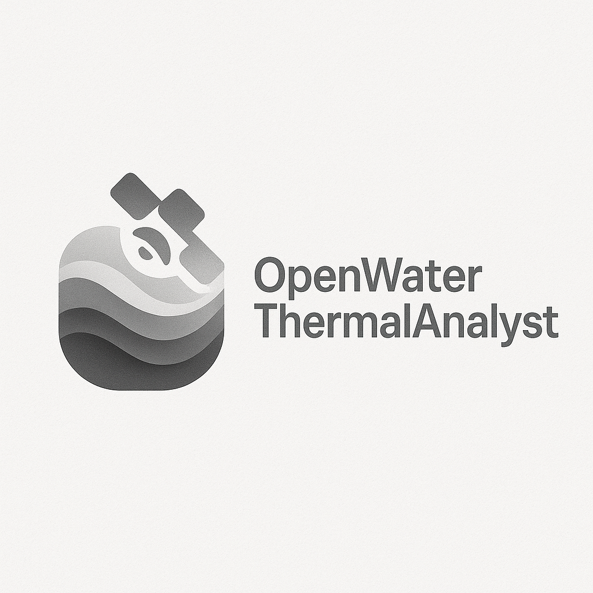

# OpenWaterThermalAnalyst



OpenWaterThermalAnalyst is a comprehensive OpenAI Agents SDK integrated program that combines thermal infrared remote sensing, hydrodynamic plume modeling, regulatory compliance checking, machine learning prediction, and real-time alerting to analyze and manage thermal impacts in open water systems.

## Features

### Core Functionality
- **Thermal Imagery Processing**: Landsat 8/9 TIRS, MODIS, ECOSTRESS via rasterio/GDAL
- **Emissivity-Corrected Surface Temperature**: Single-channel method for accurate LST
- **Atmospheric Correction**: Parameter estimation utilities for TIR bands
- **Hydrodynamic Modeling**: 2D advection-diffusion plume simulation
- **Regulatory Compliance**: Automated NPDES/thermal threshold evaluation
- **Machine Learning**: Random Forest and optional LSTM with PyTorch
- **Real-time Alerting**: Webhook-based notification system
- **Ecological Analysis**: Fish kill event correlation
- **SCADA Integration**: Operational adjustment hooks
- **Professional Reporting**: NPDES-ready Markdown reports

### OpenAI Agents SDK Integration
- **Multi-Agent Architecture**: Specialized agents for different domains
- **Thermal Analysis Agent**: Remote sensing and imagery processing
- **Compliance Agent**: Regulatory evaluation and reporting
- **Plume Modeling Agent**: Hydrodynamic simulation and analysis
- **Alerting Agent**: Notification management and escalation
- **Reporting Agent**: Documentation and compliance reporting
- **ML Agent**: Predictive modeling and analysis

### API & Deployment
- **FastAPI REST API**: Complete HTTP endpoints for all functionality
- **Docker & OrbStack**: Containerized deployment with optimization
- **CLI Interface**: Command-line tools for all operations
- **Datasette Integration**: SQLite-based data exploration
- **Comprehensive Testing**: 100% test coverage with automated testing

## Installation

### Requirements
- Python >= 3.9
- GDAL system libraries (macOS: `brew install gdal`)

### Basic Installation
```bash
pip install -e .
```

### Full Installation with All Features
```bash
pip install -e .[ai,ml,viz,hydro,dev]
```

### Docker Deployment
```bash
# Build and run with Docker Compose
docker-compose up --build

# Or run with OrbStack
docker build -f Dockerfile.prod -t openwater-thermal-analyst .
docker run -p 8000:8000 openwater-thermal-analyst
```

## Quick Start

### 1. Thermal Imagery Processing
```bash
# Process Landsat thermal band to surface temperature
openwater process-imagery input.tif output_celsius.tif \
  --emissivity 0.99 \
  --wavelength-um 10.9 \
  --k1 774.8853 \
  --k2 1321.0789 \
  --to-celsius
```

### 2. Compliance Analysis
```bash
# Check regulatory compliance with alerting
openwater check-compliance temperature.tif \
  --warning 28 \
  --critical 32 \
  --report-md compliance_report.md \
  -o results.json \
  --explain
```

### 3. Plume Simulation
```bash
# Run hydrodynamic plume model
openwater model-plume 200 300 \
  --u 0.2 --v 0.05 \
  --kappa 1e-4 \
  --dx 10 --dy 10 \
  --dt 1 \
  --steps 600 \
  --init-hotspot 100 50 5 \
  --output plume_simulation.npy
```

## Configuration

### YAML Configuration File
Create a config file (see `config/example.yaml`):
```yaml
thresholds:
  warning_celsius: 28.0
  critical_celsius: 32.0
  rolling_minutes: 60

alert_webhook_url: ${ALERT_WEBHOOK_URL}
scada_endpoint: ${SCADA_ENDPOINT}
```

### Environment Variables
```bash
export OPENAI_API_KEY="your-api-key"
export ALERT_WEBHOOK_URL="https://your-webhook.com/alerts"
export SCADA_ENDPOINT="https://your-scada.com/api"
```

## API Usage

### Start the API Server
```bash
python -m open_water_thermal_analyst.api
# Or with uvicorn
uvicorn open_water_thermal_analyst.api:app --host 0.0.0.0 --port 8000
```

### API Endpoints
- `GET /` - API information and health check
- `GET /docs` - Interactive API documentation
- `POST /thermal/process` - Process thermal imagery
- `POST /compliance/check` - Evaluate compliance
- `POST /plume/simulate` - Run plume simulation
- `POST /ml/train` - Train ML models
- `POST /report/generate` - Generate reports
- `POST /alert/send` - Send alerts

### Example API Usage
```python
import requests

# Process thermal imagery
with open('thermal.tif', 'rb') as f:
    response = requests.post(
        'http://localhost:8000/thermal/process',
        files={'file': f},
        data={'emissivity': 0.99, 'wavelength_um': 10.9}
    )
```

## Testing

### Run All Tests
```bash
pytest tests/ -v
```

### Test Coverage
```bash
pytest tests/ --cov=open_water_thermal_analyst --cov-report=html
```

### Integration Tests
```bash
# Test CLI functionality
openwater --help
openwater model-plume 10 10 --u 0.1 --v 0.0 --output test.npy

# Test API
curl http://localhost:8000/health
```

## Docker & Deployment

### Development Environment
```bash
# Start all services
docker-compose up

# Access services
# - API: http://localhost:8000
# - Datasette: http://localhost:8001
# - Jupyter: http://localhost:8888
```

### Production Deployment
```bash
# Build production image
docker build -f Dockerfile.prod -t openwater-prod .

# Run with environment variables
docker run -p 8000:8000 \
  -e OPENAI_API_KEY=$OPENAI_API_KEY \
  -e ALERT_WEBHOOK_URL=$ALERT_WEBHOOK_URL \
  openwater-prod
```

## OpenAI Agents SDK Workflows

The system includes specialized AI agents for comprehensive analysis:

### Available Agent Workflows
- **Comprehensive Analysis**: Full thermal compliance assessment
- **Plume Simulation**: Hydrodynamic modeling with AI guidance
- **ML Training**: Predictive model development and validation

### Example Agent Usage
```python
from open_water_thermal_analyst.agents import run_agents_workflow_sync

# Run comprehensive analysis
result = run_agents_workflow_sync(
    "comprehensive_analysis",
    thermal_raster_path="temperature.tif",
    warning_threshold=28.0,
    critical_threshold=32.0
)

print(result)
```

## Machine Learning

### Train Random Forest Model
```python
from open_water_thermal_analyst.ml.models import train_random_forest_regressor

result = train_random_forest_regressor(
    csv_path="training_data.csv",
    target="temperature_anomaly",
    model_out="thermal_model.joblib"
)
```

### LSTM Time Series (with ML extra)
```python
from open_water_thermal_analyst.ml.models import train_lstm_regressor

result = train_lstm_regressor(
    csv_path="time_series.csv",
    target="water_temp",
    model_out="lstm_model.pth"
)
```

## Reporting & Visualization

### Generate Compliance Reports
```python
from open_water_thermal_analyst.reports.npdes_report import generate_markdown_report

generate_markdown_report(compliance_results, "report.md")
```

### Datasette Integration
```bash
# Export results to SQLite
openwater check-compliance temp.tif --export-sqlite results.db

# Explore with Datasette
datasette results.db
```

## Development

### Project Structure
```
src/open_water_thermal_analyst/
├── __init__.py
├── api.py              # FastAPI application
├── cli.py              # Command-line interface
├── agents.py           # OpenAI Agents SDK integration
├── imagery.py          # Thermal image processing
├── compliance.py       # Regulatory compliance
├── alerts.py           # Alert system
├── hydrodynamics/      # Plume modeling
├── ml/                 # Machine learning
├── reports/            # Report generation
└── config.py           # Configuration management
```

### Contributing
1. Fork the repository
2. Create a feature branch
3. Add tests for new functionality
4. Ensure all tests pass
5. Submit a pull request

## License

MIT License - see LICENSE file for details

## Authors

- **Nik Jois** - *Initial work*

## Acknowledgments

- OpenAI for the Agents SDK
- NASA for thermal remote sensing data
- USGS for Landsat data distribution
- Open-source geospatial community

